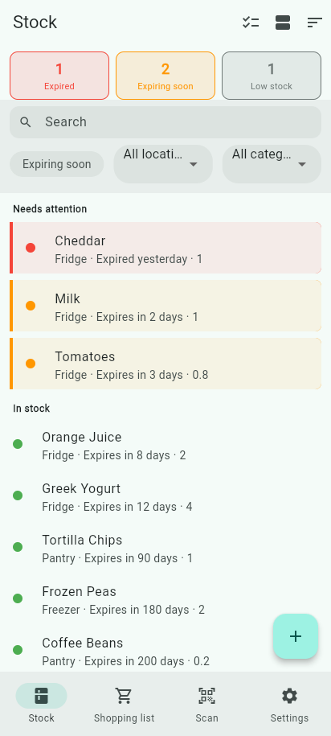
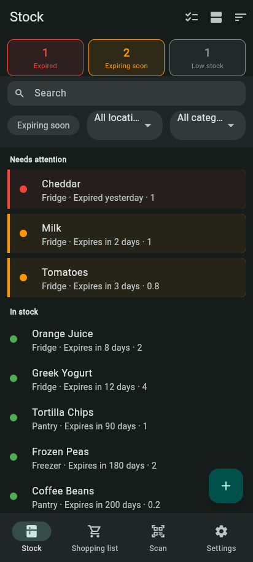
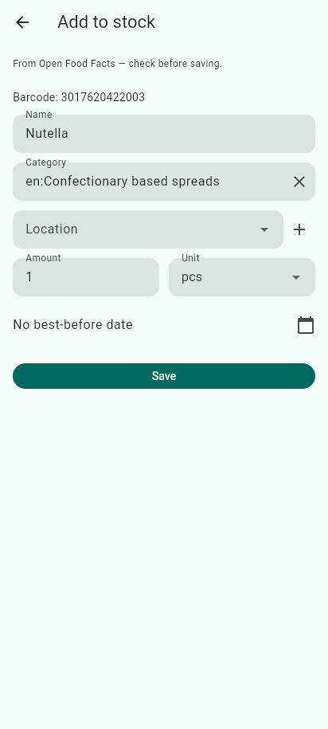
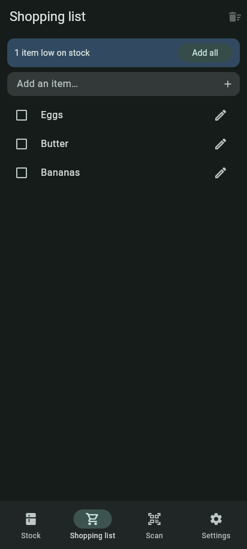
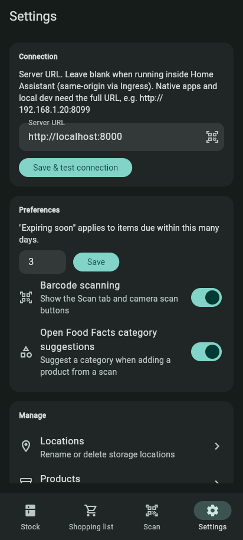

# Vorrat

[](https://github.com/MarcelMuechler/Vorrat/actions/workflows/ci.yml)
[](https://github.com/MarcelMuechler/Vorrat/releases)
[](LICENSE)

Self-hosted household stock/inventory management — a Grocy alternative.

<br clear="left">

## Features

- Stock overview with best-before-date tracking, grouped into "needs attention" / "in stock"
- Barcode scanning (Android, iOS, Web), with an offline queue for scans made without a
  connection and a scan history
- Open Food Facts lookup for unknown products, with a custom-photo upload fallback
- Multiple/alternate barcodes per product
- Stock batches — track several purchases of the same product with different
  best-before dates and locations
- Consumption log with undo
- Shopping list, with a one-tap "add low stock" shortcut
- Categories and locations management
- CSV import/export of stock
- In-app SQLite backup/restore from Settings
- Deployable as a Home Assistant add-on (with a `/api/stats` REST sensor for
  automations), or standalone via Docker

## Screenshots

| Stock (light) | Stock (dark) | Barcode scan → Open Food Facts |
|---|---|---|
|  |  |  |

| Shopping list | Settings |
|---|---|
|  |  |

## Layout

- `backend/` — FastAPI + SQLAlchemy + Alembic + SQLite REST API
- `frontend/` — Flutter app (Android, iOS, Web)
- `vorrat/` — Home Assistant app packaging (config, Dockerfile)
- `docs/` — architecture notes

## Development

```sh
# backend
cd backend && uv run uvicorn app.main:app --reload

# frontend (point Settings → Server URL at http://localhost:8000 once running,
# since the Flutter dev server and uvicorn are on different origins)
cd frontend && flutter build web && python3 -m http.server 8090 -d build/web
```

The backend exposes interactive API documentation at `http://localhost:8000/docs` (Swagger UI) —
open it to browse endpoints, see request/response schemas, and try the REST API directly.

## Installing on Home Assistant

In Home Assistant, go to Settings → Add-ons → Add-on Store → ⋮ → Repositories, and add
[`vorrat-hassio-addon`](https://github.com/MarcelMuechler/vorrat-hassio-addon) — a thin
wrapper repo that clones this repo's tagged releases at build time (see "Releasing" below
for why it's separate). Install "Vorrat" from the store, start it, and open it from the
sidebar. See [`vorrat/DOCS.md`](vorrat/DOCS.md) for mobile app setup.

## Building an Android APK

There's no Play Store listing, so installing on a phone means building the APK yourself and
sideloading it:

```sh
cd frontend
flutter build apk --release
```

This produces `frontend/build/app/outputs/flutter-apk/app-release.apk`. The release build
is signed with Flutter's debug key (see `frontend/android/app/build.gradle.kts` — there's no
release signing config), which is fine for installing on your own device but not for
distributing further or publishing to a store.

To get it onto a phone, either:

- **Via USB**: enable Developer options → USB debugging on the phone, connect it, then
  `adb install frontend/build/app/outputs/flutter-apk/app-release.apk` (or `flutter install`
  from `frontend/` with the device connected).
- **Without USB**: copy the APK to the phone any way you like (cloud storage, a file share,
  emailing it to yourself) and open it there. Android will prompt to allow installs from
  that source ("Install unknown apps") the first time — allow it, then continue the install.

Once installed, open the app's Settings tab and set the server URL to point at your backend
(same as the Home Assistant mobile setup — see [`vorrat/DOCS.md`](vorrat/DOCS.md)).

## Adding a translation

The app's strings live in `frontend/lib/l10n/app_en.arb` (the template — one key per
string) with translations alongside it as `app_<locale>.arb` (e.g. `app_de.arb` for German).
To add another language:

1. Copy `frontend/lib/l10n/app_en.arb` to `frontend/lib/l10n/app_<locale>.arb` (e.g.
   `app_fr.arb` for French), and change its `"@@locale"` value to match.
2. Translate every value, keeping the keys (and `{placeholder}` tokens) unchanged.
3. Run `flutter pub get` in `frontend/` (or just build/test — `generate: true` in
   `pubspec.yaml` regenerates `AppLocalizations` automatically) to confirm it compiles.

That's it — `MaterialApp.supportedLocales` is generated from whatever `app_*.arb` files
exist, so a new locale is picked up automatically; there's no separate list to edit.
CI runs `frontend/scripts/check_arb_completeness.py`, which fails the build if a
translation file is missing any key present in `app_en.arb`, so an incomplete translation
gets caught at PR time instead of silently falling back to English (or crashing) at runtime.

## Commit message convention

Commit messages follow [Conventional Commits](https://www.conventionalcommits.org/):
`<type>: <description>`, e.g. `fix: reject non-positive amounts in consume_stock` or
`feat: add partial stock consumption to the overview screen`. This repo's history already
follows this — see `git log` — so it's a matter of keeping it up, not a new habit.

The type determines the version bump, via [release-please](https://github.com/googleapis/release-please) (`.github/workflows/release-please.yml`):

- `fix:` → patch
- `feat:` → minor
- A `!` after the type (e.g. `feat!:`) or a `BREAKING CHANGE:` footer → major
- `chore:`, `docs:`, `refactor:`, etc. → no bump, unless they carry a `BREAKING CHANGE:` footer

## Releasing

release-please watches `main` and keeps a standing "Release PR" up to date, bumping
`backend/pyproject.toml`, `frontend/pubspec.yaml`, `vorrat/config.yaml`, and `CHANGELOG.md`
to whatever version the commits since the last release call for (see "Commit message
convention" above). The same workflow re-runs `uv lock` and pushes the result onto that PR's
branch whenever the PR is created or updated, so `backend/uv.lock` is always in sync with
`backend/pyproject.toml` *before* the PR is merged — CI's `uv lock --check` step rejects the
PR (like any other PR) if the lock ever drifts. Nothing is tagged or released until you merge
that PR — review it like any other PR, then merge:

1. Merge the open "chore(main): release X.Y.Z" PR. This tags `vX.Y.Z` and cuts a GitHub
   Release.
2. The same workflow run then automatically syncs
   [`vorrat-hassio-addon`](https://github.com/MarcelMuechler/vorrat-hassio-addon) — bumping
   `vorrat/config.yaml`'s `version` and `vorrat/Dockerfile`'s `ARG VORRAT_REF` to the new tag
   and pushing — since the Home Assistant add-on store only rechecks *that* repo's
   `config.yaml` for a new `version` string; it never looks at this repo directly, and never
   re-runs a Docker build on its own.
   - Requires a `HASSIO_ADDON_PAT` repository secret (a PAT with write access to
     `vorrat-hassio-addon`) — the default `GITHUB_TOKEN` can't push to a different repo.
     Without it, this step fails loudly rather than silently skipping.
   - `VORRAT_REF` must point at a tag, never `main` — Docker caches the `RUN git clone`
     layer by its literal command text, so a floating branch ref cache-hits forever and
     rebuilds silently keep serving whatever was cloned on the very first build.
3. In Home Assistant: Settings → Add-ons → Add-on Store → ⋮ → **Check for updates** (a
   plain reinstall/rebuild does *not* refresh the store's cached repo metadata), then
   update the Vorrat add-on. This last step is still manual — it happens on the HA instance,
   outside GitHub's reach.

## Running standalone via Docker

```sh
docker build -f vorrat/Dockerfile -t vorrat .
docker run -d -p 8099:8099 -v vorrat-data:/data vorrat
```

Or with Docker Compose:

```sh
docker compose up -d
```

(See `docker-compose.yml` at the repo root for the compose configuration.)

No authentication in v1 — intended for a trusted home network / Home Assistant Ingress.

### Environment variables

The backend reads these environment variables to configure runtime behavior:

| Variable | Default | Description |
|----------|---------|-------------|
| `DATABASE_URL` | `sqlite:///./vorrat.db` | SQLAlchemy connection string for the database. For standalone Docker, the included volume mount handles this; for other deployments, set this if you need a different database path or connection string. |
| `OFF_USER_AGENT` | `Vorrat/0.1 (+https://github.com/MarcelMuechler/vorrat)` | User-Agent header sent to Open Food Facts API when looking up unknown products by barcode. Customize only if requested by the Open Food Facts maintainers. |
| `OFF_BASE_URL` | `https://world.openfoodfacts.org` | Base URL of the Open Food Facts API used for barcode lookups. Override to point at a self-hosted mirror, a regional OFF instance, or a test double. |
| `EXPIRING_SOON_DAYS` | `3` | Number of days used to compute the "expiring soon" status: items with a best-before date within this many days are marked as expiring soon. This value seeds the database on first run; it can be changed at runtime via the settings API. |

## Home Assistant sensors

`GET /api/stats` returns a summary of your stock — no MQTT or custom HA integration needed,
just Home Assistant's built-in [`rest:`](https://www.home-assistant.io/integrations/rest/)
integration polling that one endpoint:

```json
{
  "total_products": 42,
  "total_stock_entries": 57,
  "expired": 1,
  "expiring_soon": 3,
  "low_stock_products": 2,
  "earliest_expiry": "2025-01-20"
}
```

Ingress URLs aren't stable (Home Assistant mints a new per-session path each time), so point
the sensor at the add-on's host:port instead — e.g. `http://homeassistant.local:8099` if
you're running the HA add-on, or whatever host/port you published with `docker run -p`. For
the add-on, the `8099/tcp` port must be exposed under the add-on's Network configuration
(Settings → Add-ons → Vorrat → Configuration → Network) for this to be reachable — it's
enabled by default in `vorrat/config.yaml`, but check it hasn't been turned off.

Add this to `configuration.yaml` (or a package file), swapping in your own URL:

```yaml
rest:
  - resource: http://homeassistant.local:8099/api/stats
    scan_interval: 300
    sensor:
      - name: "Vorrat expired items"
        value_template: "{{ value_json.expired }}"
        unit_of_measurement: "items"
      - name: "Vorrat expiring soon"
        value_template: "{{ value_json.expiring_soon }}"
        unit_of_measurement: "items"
      - name: "Vorrat low stock products"
        value_template: "{{ value_json.low_stock_products }}"
        unit_of_measurement: "products"
```

And an example automation that notifies your phone when something has expired:

```yaml
automation:
  - alias: "Notify on expired stock"
    trigger:
      - platform: numeric_state
        entity_id: sensor.vorrat_expired_items
        above: 0
    action:
      - service: notify.mobile_app_your_phone
        data:
          message: >
            {{ states('sensor.vorrat_expired_items') }} item(s) in Vorrat have expired.
```

MQTT and a custom HA integration were both considered and rejected for v1 — `rest:` covers
the "show a number, fire an automation" use case with nothing to run or maintain beyond this
one endpoint.

## License

[MIT](LICENSE)
